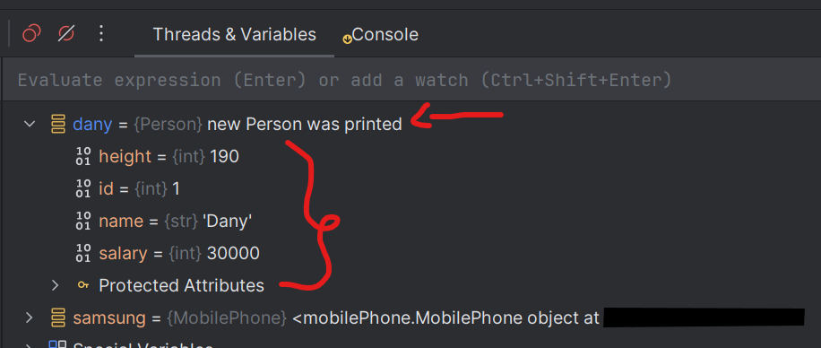

# python-OOP-Lec14-11-MAY-25

Class set, get function, class functions

* drew classes graph- called UML patterns
* constructor-ctor (בנאי):
    * =init function = a dander function:
  ```
  def __init__(self,_brand):
    self.brand=_brand
    self.created=dateTime.now()
  ```
    * if we don't write it, when creating object from a class,
      the python will run the ctor with nothing in it, as default.
    * to force create object with limited attributes, will send to the
    * self= i talk about the current object and only on it, the changes will be change only on this object
        * = this in other languages
    * can add self attributes without sending parameters in the ctor
* function __str__=toString() : to return object's content, this function return str:
    * we can override the __str__ function:
  ```
        def __str__(self):
           # return  str(self.__dict__)  # will return all object's attributes as dict 
           # return "new Mobile Phone was printed"
           # return f"{self.id}" # will return object's id value only
  ```
    * to activate the function:print(samsung)= will activate the __str__ function 
  * in the debug mode you can see the __str__ content and under the object attributes:
   
* __repr__ function: 2 usages:
  1) str like
    * bag:list[MobilePhone]=[samsung,iphone]: to create list of objects
    * print(bag): will not activate the str of each object, to fix it, need to override the function  ```
  ```     
  def __repr__(self):
        return self.__str__
  ```
  * developer code :
    * copy object like this current object :
  ```
  def __repr__(self):
     return f"MobilePhone('{self.brand}','{self.color}',{self.battery}')"
  ```
  * If __str__() is not defined, Python will use __repr__() when printing
* def __del__(self): function in cases we want to do actions before deleting the object